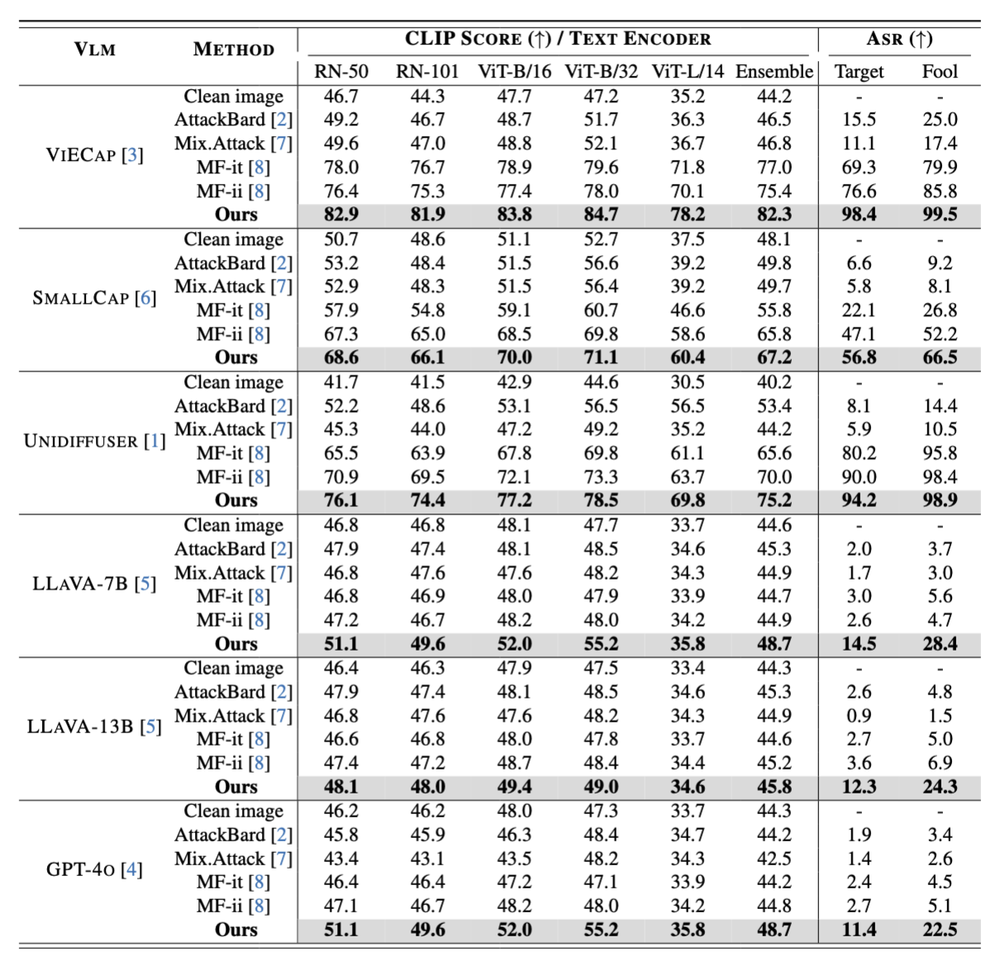

# Chain of Attack: On the Robustness of Vision-Language Models Against Transfer-Based Adversarial Attacks

Most existing transfer-based attacks neglect the importance of the semantic correlations between vision and text modalities, leading to sub-optimal adversarial example generation and attack performance. To address this issue, we present **Chain of Attack (CoA)**, which iteratively enhances the generation of adversarial examples based on the multi-modal semantic update using a series of intermediate attacking steps, achieving superior adversarial transferability and efficiency. A unified attack success rate computing method is further proposed for automatic evasion evaluation. Extensive experiments conducted under the most realistic and high-stakes scenario, demonstrate that our attacking strategy can effectively mislead models to generate targeted responses using only black-box attacks without any knowledge of the victim models. The comprehensive robustness evaluation in our paper provides insight into the vulnerabilities of VLMs and offers a reference for the safety considerations of future model developments. [[Paper](https://openaccess.thecvf.com/content/CVPR2025/html/Xie_Chain_of_Attack_On_the_Robustness_of_Vision-Language_Models_Against_CVPR_2025_paper.html)]


## 🚀 News

- [28/02/2025] **Chain of Attack** is accepted by CVPR 2025!
- [24/11/2024] We introduce **Chain of Attack**, a new and efficient transfer-based attacking strategy for VLMs. The manuscript can be found on [arXiv](https://arxiv.org/pdf/2411.15720).


## Benchmark of VLM Against Transfer-based Adversarial Attack  



## Preparation of clean image-text pairs
- Clean image: the clean images are from the validation set of [ImageNet-1K](https://www.image-net.org/).
- Clean text: [MiniGPT-4](https://github.com/Vision-CAIR/MiniGPT-4) is adopted to generate clean descriptions for the clean images. The usage is as follows:
```
cd Clean_text_generation_minigpt4

python minigpt4_img2text.py
    --cfg-path "minigpt4_eval.yaml" \
    --gpu-id 0 \
    --query "describe this image in one sentence." \
    --dataset_path [clean_image_path] \
    --save_path [caption_save_path]
```


## Preparation of target image-text pairs
- Target text (caption): the targeted reference texts can be obtained by sampling from [MS-COCO](https://cocodataset.org/) captions. To further improve the attacking performance, we adopt GPT-4 to extract the key information of the sampled target texts.
- Target image: the target images can be generated using [Stable Diffusion](https://github.com/CompVis/stable-diffusion), [DALL-E](https://arxiv.org/pdf/2102.12092), or [Midjourney](https://www.midjourney.com/) based on the target texts.

## Chain of Attack
In the adversarial example generation process of **CoA**, a lightweight VLM [ClipCap](https://arxiv.org/pdf/2111.09734) is adopted as the image-to-text model. The pre-trained [weights](https://drive.google.com/file/d/14pXWwB4Zm82rsDdvbGguLfx9F8aM7ovT/view?usp=sharing) and inference code of ClipCap can be found [here](https://github.com/rmokady/CLIP_prefix_caption).

Training (please set the path properly):
```
python train.py \
        --batch_size 1 \
        --num_samples 10000 \
        --input_res 224 \
        --clip_encoder ViT-B/32 \
        --alpha 1.0 \
        --p_neg 0.7 \
        --epsilon 8 \
        --pgd_steps 100 \
        --a_weight 0.3 \
        --speed_up False \
        --update_steps 1 \
        --output [output_folder] \
        --cle_data_path [clean_dataset_path] \
        --tgt_data_path [target_image_path] \
        --model_path "clip_prefix_model/conceptual_weights.pt" \
        --prefix_length 10 \
        --tgt_file_path "[your_path]/coco_captions_1000.txt" \
        --cle_file_path "[your_path]/llava_textvqa.txt" \
        --fusion_type add_weight
```

## 🔍Evaluation

- CLIP Score: This metric can be computed using the following script.
```
python eval.py \
    --batch_size 100 \
    --num_samples 10000 \
    --pred_text_path [generated_text_path] \
    --tgt_text_path [target_text_path]
```
- LLM-based Attack Success Rate (ASR) – This metric can be computed using GPT-4 with our provided prompt. See details in `ASR.md` under the `ASR` folder.

  
## 📚Citation
```bibtex
@inproceedings{xie2025chain,
  title={Chain of Attack: On the Robustness of Vision-Language Models Against Transfer-Based Adversarial Attacks},
  author={Xie, Peng and Bie, Yequan and Mao, Jianda and Song, Yangqiu and Wang, Yang and Chen, Hao and Chen, Kani},
  booktitle={Proceedings of the Computer Vision and Pattern Recognition Conference},
  pages={14679--14689},
  year={2025}
}
```

## 🙏Acknowledgement
Our code is based on [AttackVLM](https://github.com/yunqing-me/AttackVLM). Thanks for their contributions to the community.